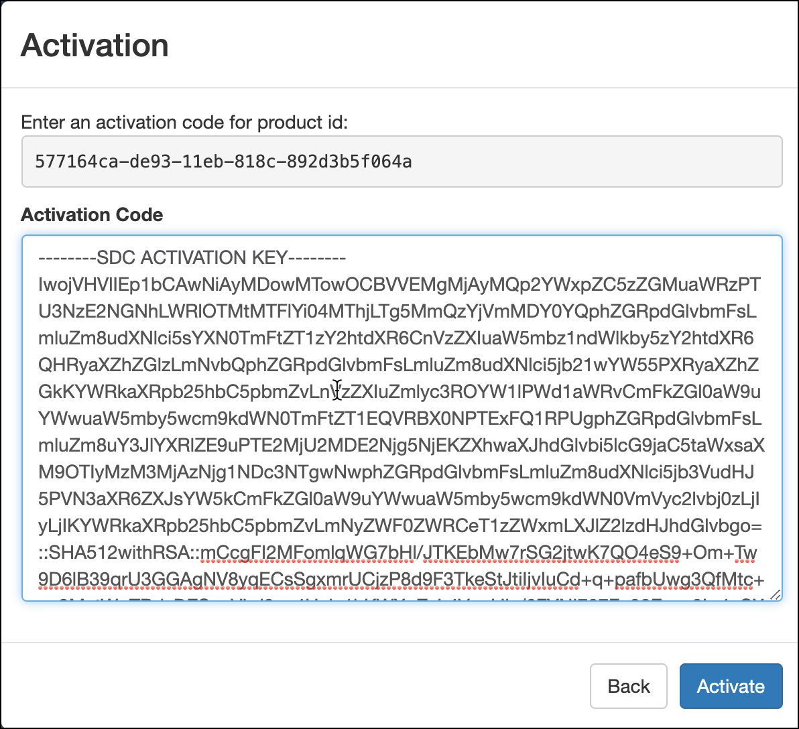

***

## tecnologías: streamsets&#xD;&#xA;versión: 1.13.0&#xD;&#xA;validado en: 6.7.2021

# Compatibilidad con la activación del recopilador de datos StreamSets

Esta receta mostrará cómo admitir la activación de StreamSets Data Collector de forma persistente y rejugable.

El problema con la activación de StreamSets es que se da un código de activación para un determinado `SDC ID` (también conocido como id de producto). Si reinicia el contenedor del recopilador de datos De StreamSets, todo está bien, pero si detiene, quita y reclasifica el contenedor, un nuevo `SDC ID` se genera y hay que volver a activar StreamSets.

Esta receta muestra, cómo el `SDC ID` se puede fijar a un valor, de modo que la recreación de un contenedor no lo cambie.

## Inicializar la plataforma de datos

Primero [inicializar una plataforma de datos compatible con platys](../documentation/getting-started.md) con los siguientes servicios habilitados

    platys init --enable-services STREAMSETS -s trivadis/platys-modern-data-platform -w 1.13.0

Edite el `config.yml` y agregue las siguientes opciones de configuración.

          STREAMSETS_http_authentication: 'form'
          STREAMSETS_sdc_id: ''

Ahora genere una plataforma de datos

    platys gen

y luego inicie la plataforma:

    docker-compose up -d

## Activar StreamSets

Desplácese a <http://dataplatform:18630> e iniciar sesión con **usuario** establecer en `admin` y **contraseña** establecer en `admin`.

Haga clic en **Introduzca un código** y en el **Activación** haga clic en la página **Atrás**. El **Registro** se debe mostrar la página.

Rellena todos los campos y haz clic en **Acepte los términos y regístrese**.

Revise su bandeja de entrada de correo electrónico, después de un corto tiempo debe recibir un correo electrónico con un código de activación.

Copie la sección dentro de `--------SDC ACTIVATION CODE--------` (el ejemplo a continuación ha sido manipulado, por lo que ya no es utilizable)

    --------SDC ACTIVATION CODE--------
    xcvxcvcxvxvxcvxcvxvxvxvsdfsfsfsf=::SHA512withRSA::mCcgFI2MFomlqWG7bHl/JTKEbMw7rSG2jtwK7QO4eS9+Om+Tw9D6lB39qrUd3GGAgNV8yqECsSgxmrUCjzP8d9F3TkeStJtiIjvIuCd+q+pafbUwg3QfMtc+xn8MxtWpTBdyDESoxVLd3qy4Heje1hKWXpZyL4VcvxcvxcvcxvmJJia/6FYNI787Fn30Evxo9Lr4vCXrB4jY+3mFbzJy1G64ZJgF7fRz8RNe3D0XwklhemcmbX0c8i+82qdCIU58b/xvl+n+RwyFC9F6sVBfEDVAS9aQJu99EkF+Nm0aHtp8GAaNEOwi6nYCInAboetDTNqZxkaopwAXogGB/0r88+gqO+Dx8ce8a60hRoRX/8fqqr4ZtPin9WQrxPLdiSCcUZLQs/0r88+gqO+Dx8ce8a60hRoRX/8fqqr4ZtPin9WQrxPLdiSCcUZLQs/0r88+gqO+Dx8ce8a60hRoRX/8fqqr4ZtPin9WQrxPLdiSCcUZLQs/zx8svPy1YWpLR5fj8wQXSt3uGBi+pdalivMzazxcvxxcvxcxvvxxcvxcvGNrdJlvLSf70ugQzp6oMrm1edZHzsX9MPNliRyFMGhVsBB8tot3sZW4xVPOYaR3ndXRHVMUYtkU8fOMBFBnaF7XYKmTe4cLaAHTMDYaev32d/8ZMt09BMAjv32IqEhBjp6YZvVkYs2wbcX35EPOxcvxvxvccxvxxvxvcRdtBQWvwJXghFqa0aa+Ln3pYW1z7L1pKlWj4kViqex06BfVAlwSlj8I7CG0RBPth4dLDJPQPbVrpU4nKJHGZIr7THJxpB133PZrXr6JI15DyYk5xnURve5F0=
    --------SDC ACTIVATION CODE--------

y péguelo en el **Código de activación** en el campo **Activación** pantalla. Tome nota de la identificación del producto que se muestra arriba de la **Código de activación** (lo usaremos en la siguiente sección).

Asegúrese de reemplazar ambos `SDC ACTIVATION CODE` con `SDC ACTIVATION KEY` y haga clic en **Activar**. La ventana debe cerrarse y en otro cuadro de diálogo emergente debería poder hacer clic en **Recargar** para finalizar la activación de StreamSets.

## Fijar el ID de SDC al valor utilizado para la activación

Ahora entraremos en el `SDC ID` (id. de producto) en el `config.yml` para que "surrive" un contenedor se detenga y retire.

Para obtener el valor correcto, puede comprobar el registro o utilizar el valor de la página Activación antes.

Para recuperarlo del registro, realice

    docker-compose logs -f streamsets-1 | grep "SDC ID"

Debería ver un resultado similar al siguiente

    docker@ubuntu:~/platys-cookbook$ docker-compose logs -f streamsets-1 | grep "SDC ID"
    streamsets-1         | 2021-07-06 19:49:59,955 [user:] [pipeline:] [runner:] [thread:main] [stage:] 
    INFO  Main -   SDC ID        : 577164ca-de93-11eb-818c-892d3b5f064a

Copiar la información del ID de la COSUDE `577164ca-de93-11eb-818c-892d3b5f064a` y péguelo en el `STREAMSETS_sdc_id` del `config.yml`.

    STREAMSETS_sdc_id: '577164ca-de93-11eb-818c-892d3b5f064a'

Regenerar la pila

    platys gen

Reinicie docker-compose

    docker-compose up -d

y la salida de follwing debe mostrarse en la consola

    Recreating streamsets-1 ... 
    wetty is up-to-date
    Recreating streamsets-1    ... done
    Starting markdown-renderer ... done

Como puede ver, el `streamsets-1` el contenedor se volverá a crear, utilizando el mismo `SDC ID` como antes.

Al volver a cargar la interfaz de usuario de StreamSets, tendrá que volver a activarla, pero ahora puede usar exactamente el mismo código de activación que antes.
